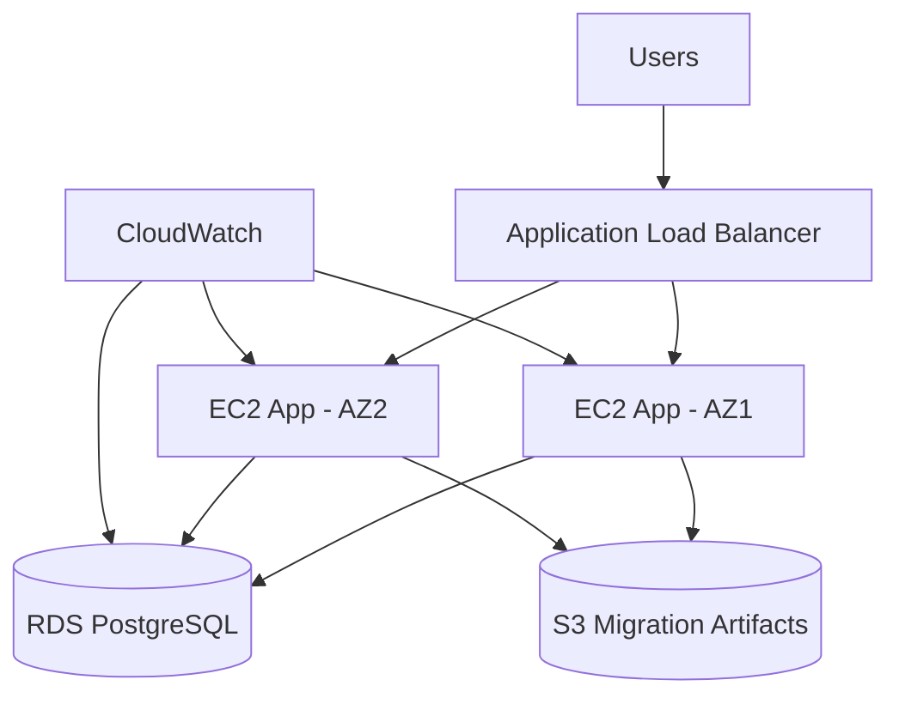

# NovaRetail AWS Migration Lab

A complete portfolio project simulating the work of a **Junior Infrastructure Migration Consultant**.

The fictional client, **NovaRetail France**, is moving a small legacy/on-premises estate to AWS. The repository demonstrates the full migration lifecycle:

1. Discovery and assessment
2. 6R migration strategy
3. Target AWS architecture
4. Infrastructure as Code with Terraform
5. Pre-migration checks
6. Migration execution and validation
7. Rollback planning
8. Hypercare and operational handover

> This is a lab, not a claim of real customer production work. It is designed to demonstrate methodology, documentation, automation and technical reasoning.

## Skills demonstrated

- AWS: VPC, subnets, routing, EC2, ALB, RDS, S3, IAM, CloudWatch
- Networking: CIDR, routing, security groups, public/private subnets
- Terraform and Infrastructure as Code
- Linux troubleshooting
- Python and Bash automation
- 6R migration strategy
- Runbooks, rollback plans, risk management and hypercare
- Business-to-technology consulting
- GitHub Actions CI validation

## Architecture



See `docs/architecture.md` for the network and security design.

## Structure

```text
novaretail-aws-migration/
├── .github/workflows/terraform.yml
├── app/
├── docs/
├── sample-data/
├── scripts/
├── terraform/
├── .gitignore
├── README.md
└── VALIDATION.md
```

## Prerequisites

- AWS account
- AWS CLI configured
- Terraform >= 1.6
- Python 3.10+
- Bash
- Git

```bash
aws sts get-caller-identity
```

## Quick start

```bash
git clone <your-repository-url>
cd novaretail-aws-migration/terraform
cp terraform.tfvars.example terraform.tfvars
terraform init
terraform fmt
terraform validate
terraform plan
terraform apply
```

Then:

```bash
terraform output -raw application_url
```

Run validation:

```bash
cd ..
python3 scripts/post_migration_validation.py --url "$(cd terraform && terraform output -raw application_url)"
```

Destroy after the lab:

```bash
cd terraform
terraform destroy
```

## Cost warning

This lab can create billable resources, especially a **NAT Gateway**, **Application Load Balancer**, **EC2** and **RDS**. Destroy the environment after use.

## Interview explanation

> “I built a complete migration simulation for a fictional retailer moving from on-premises infrastructure to AWS. I started with inventory and dependency assessment, selected strategies using the 6R model, designed the target architecture, provisioned it with Terraform, created pre- and post-migration validation scripts, and documented cutover, rollback and hypercare. The project helped me connect technical migration work with business continuity, risk, stakeholder communication and operational readiness.”

## Extensions

- AWS Database Migration Service (DMS)
- AWS Application Migration Service (MGN)
- GitHub Actions deployment with approval gates
- CloudWatch dashboards
- AWS Backup
- Systems Manager patching
- Azure/GCP comparison
