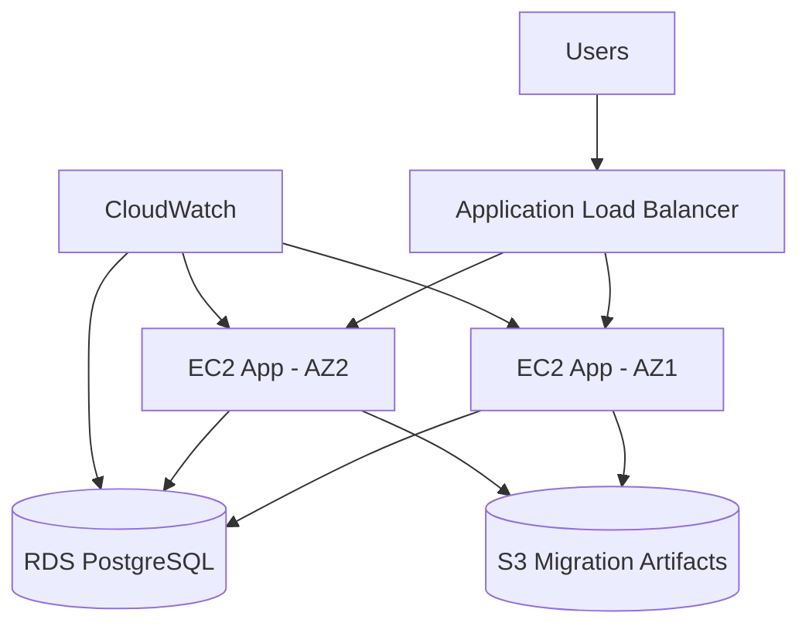

# NovaRetail AWS Migration Lab

A complete portfolio project simulating the work of an Infrastructure Migration Consultant

The  client, **NovaRetail France**, is moving a small legacy/on-premises estate to AWS. The repository demonstrates the full migration lifecycle:

1. Discovery and assessment
2. 6R migration strategy
3. Target AWS architecture
4. Infrastructure as Code with Terraform
5. Pre-migration checks
6. Migration execution and validation
7. Rollback planning
8. Hypercare and operational handover

> This is a lab,  designed to demonstrate methodology, documentation, automation and technical reasoning.

## Skills demonstrated

- AWS: VPC, subnets, routing, EC2, ALB, RDS, S3, IAM, CloudWatch
- Networking: CIDR, routing, security groups, public/private subnets
- Terraform and Infrastructure as Code
- Linux troubleshooting
- Python and Bash automation
- 6R migration strategy
- Runbooks, rollback plans, risk management and hypercare
- Business-to-technology consulting
- GitHub Actions CI validation

## Architecture


```mermaid
flowchart TD
    U[Users] --> ALB[Application Load Balancer]
    ALB --> EC2A[EC2 App - AZ1]
    ALB --> EC2B[EC2 App - AZ2]
    EC2A --> RDS[(RDS PostgreSQL)]
    EC2B --> RDS
    EC2A --> S3[(S3 Migration Artifacts)]
    EC2B --> S3
    CW[CloudWatch] --> EC2A
    CW --> EC2B
    CW --> RDS
```

See `docs/architecture.md` for the network and security design.

## Structure

```text
novaretail-aws-migration/
├── .github/workflows/terraform.yml
├── app/
├── docs/
├── sample-data/
├── scripts/
├── terraform/
├── .gitignore
├── README.md
└── VALIDATION.md
```

## Prerequisites

- AWS account
- AWS CLI configured
- Terraform >= 1.6
- Python 3.10+
- Bash
- Git

```bash
aws sts get-caller-identity
```

## Quick start

```bash
git clone https://github.com/Etchulaureen/novaretail-aws-migration.git
cd novaretail-aws-migration/terraform
cp terraform.tfvars.example terraform.tfvars
terraform init
terraform fmt
terraform validate
terraform plan
terraform apply
```

Then:

```bash
terraform output -raw application_url
```

Run validation:

```bash
cd ..
python3 scripts/post_migration_validation.py --url "$(cd terraform && terraform output -raw application_url)"
```

Destroy after the lab:

```bash
cd terraform
terraform destroy
```

## Cost warning

This lab can create billable resources, especially a **NAT Gateway**, **Application Load Balancer**, **EC2** and **RDS**. Destroy the environment after use.

## Background and my role

This lab recreates a real migration I worked on as part of a team. That project is under NDA, so NovaRetail uses a fictional client and anonymised details.

On the original project, the work was framed first as one end-to-end capstone around the client's business problem, then split into sub-projects matched to each team member's strengths: the Terraform and network foundation, application deployment, the database, and **assessment and validation, which was my sub-project**. The proposals were merged and reviewed together for overlaps and gaps before final roles were confirmed, and delivery ran under a project manager and team lead.

**I built this repository on my own, end to end**, including the workstreams my teammates owned on the original project, to show the full migration lifecycle:

- Workload inventory, dependency mapping and 6R recommendations (`docs/02`, `docs/03`, `sample-data/inventory.csv`)
- Terraform infrastructure: two-AZ VPC, ALB, EC2, RDS, S3, IAM, CloudWatch (`terraform/`)
- Containerised application deployment (`app/`, `terraform/user_data.sh`)
- Pre- and post-migration validation scripts (`scripts/`)
- Validation of the deployed environment and an RDS snapshot restore test (`VALIDATION.md`)
- Runbook, rollback plan, risk register, hypercare and lessons learned (`docs/05` to `docs/10`)

## Project summary

The project simulates a retailer moving six on-premises workloads to AWS. It covers inventory and dependency assessment, 6R strategy, a two-AZ target architecture provisioned with Terraform, pre- and post-migration validation, a tested RDS restore, and documented cutover, rollback and hypercare. Issues found during validation, and how they were fixed, are recorded in `docs/10-lessons-learned.md`.

## Extensions

- AWS Database Migration Service (DMS)
- AWS Application Migration Service (MGN)
- GitHub Actions deployment with approval gates
- CloudWatch dashboards
- AWS Backup
- Systems Manager patching
- Azure/GCP comparison
