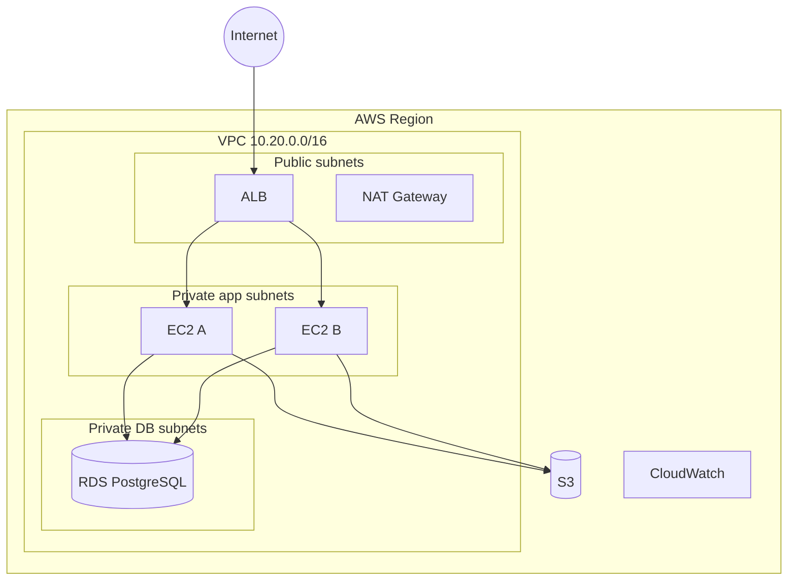

# Target AWS Architecture

## Design goals

- Two Availability Zones
- Public and private subnet separation
- Load balancing
- Private database
- IAM roles rather than embedded credentials
- CloudWatch monitoring
- Terraform-managed infrastructure

## CIDR plan

| Component | CIDR |
|---|---|
| VPC | 10.20.0.0/16 |
| Public AZ1 | 10.20.1.0/24 |
| Public AZ2 | 10.20.2.0/24 |
| App AZ1 | 10.20.11.0/24 |
| App AZ2 | 10.20.12.0/24 |
| DB AZ1 | 10.20.21.0/24 |
| DB AZ2 | 10.20.22.0/24 |

## Security groups

- ALB: inbound TCP/80 from internet
- App: inbound TCP/80 from ALB security group only
- RDS: inbound TCP/5432 from app security group only

## Production improvements

HTTPS/ACM, WAF, Multi-AZ RDS, autoscaling, AWS Backup, SSM patching, VPC endpoints, GuardDuty/Security Hub.
